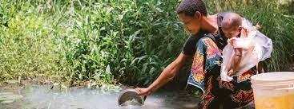

# Tanzanian Water Wells Project  
---  

Tanzania is a developing country which is struggling to provide clean water to its population of over 57,000,000. There are many water points already established in the country, but some are in need of repair while others have failed altogether. Our project is to analyze available data and advise the Tanazanian Ministry of Water on which wells to target with available resources. We also recognize that beyond the human suffering and hardship, there are secondary effects on the population from lack of clean water and we will use this project to highlight one particular issue.  

  
*Tanzanian Savannah*  

---
## Study Authors  

**Juliet Day**  
julietday422@gmail.com  
https://github.com/julietday422  

**Rishi Ahuja**  
rishiahuja515@gmail.com  
https://github.com/rishiahuja515  

**Nazar Mohl**  
nazar.mohl@gmail.com  
https://github.com/NazarMohl  

---
## Business understanding  

Stakeholder: Tanzanian Ministry of Water.  
Business Problem: Tanzania's population is 57,000,000 and 40% of Tanzanians do not have access to clean water.  

Our goal is to inform the Tanzanian Ministry of Water on how to determine which wells are functioning and recommend how to allocate their resources to increase the number of functioning wells. We will examine how many wells are functioning and under what conditions they are not functioning or need repair.  

This is not an issue people in developed nations fully understand. There is the immediate physical suffering that comes from not having water, as well as major secondary effects, such as the hinderance for young women to receive a secondary education. This is because, not having local access to clean water, means that someone has to walk, sometimes miles, to get it. In most families, the men and boys are working, which means collecting water falls on the women, and often younger women who are in better physical shape, are the ones tasked with collecting water. We belive, if more wells were functioning, less time would need to be spent trying to find water, which would allow more girls to attend secondary school.  

---  
## Data understanding  

The analysis data was provided by our stakeholder, [Tanzania's Ministry of Water](https://www.maji.go.tz/). It was recorded by GeoData Consultants Ltd, compiled by Taarifa and is available for download at DrivenData. The dataset included information about 59,400 wells and after data cleaning, we used 38,691 data points.  

The dataset had 41 different columns, however we examined 4 technical features: source type, waterpoint type, construction year, and water quality.  

Our target column was status_group which indicated whether the well was "functional", "functional needs repair" or "non functional". We created a binary classification by combining "functional needs repair" with "non functional".  

Currently, only 56% of wells are fully functioning, leaving 44% that are not functioning at all or need of repair.  

---
## Data Preparation  

Of the 4 available CSV data files, we chose the 2 training set files with which to develop our model. These provided a complete set of available well features data in the file name ending in "Training_set_values.csv" as well as the functional status of the corresponding wells in the file name ending in "Training_set_labels.csv". We merged the data from these two files into one data frame.  

The Training_set_values.csv file contained 41 columns of information about the wells which can be broadly categorized as "Technical", "Geographic"  and "Political/Organizational" information. The geographic data by itself was not sufficient to draw conclusions. It may have been more relevant if it could be married with information about land topography, seasonal weather patterns, proximity to rivers or lakes, etc. The political data had a lot of null values, non-descriptive categories such as "Other" or "Unknown". Perhaps, additional data on regional political dynamics, funding concentrations, etc. may have provided a mechanism to correlate with the functional status of wells. Many columns had overlapping or exactly duplicate data.  
  
*Getting water from a stream or river*  

For the purposes of our analysis we only retained 4 technical columns and dropped the others. This left us with the following dependent (feature) columns "source_type", "water_quality", "waterpoint_type", "construction_year". In addition, the dependent column "status_group" provided us with the functional status of each well.  

The "status_group" column provided 3 potential outcomes. We combined 2 of these into one to convert our ternary problem into a binary problem. In a new column named "sg_new" we assigned values of "non functional" and "functional needs repair" to value 0 representing a well that needs work. A value of 1 was assigned to wells that were "functional".  
  
*Colored/Milky Water*  

"construction_year" was potentially interesting to see if age could be used to determine the likelihood of a well being functional or needing work. We recognized that we could not fully rely on this column alone to make a prediction without additional information regarding maintenance history and perhaps other factors. Also, this column had a significant number of rows with the year identified as 0. We dropped the rows with the value 0 from our final data set. We then used this column to create a new column called "construction_decades" to group wells by the decade in which they were dug/established.  

The 2 columns called "status_group" and "construction_year" were dropped from the dataframe that we used to generate our models since we now had two very similar/overlapping columns called  “sg_new” and “construction_decades” .  

---
## Data Analysis  

We initially generated some charts to examine the data at a high level.  
Our first chart plotted the functional status of wells categorized by "source_type". Water sources can be surface level such as lakes and rivers, or they can be underground but close to the surface including shallow wells and springs or they can be deeper underground requiring the extensive drilling of boreholes.  
  

If we set aside the initial observation of the sheer number of non-functional wells, there is a pattern that is discernable. Boreholes and shallow wells have more functional wells than not. Wells associated with the surface such as rivers and springs tend to have more non-functioning wells.  

We next looked at the functional status of wells categorized by "Water Quality".  
  
The vast majority of wells have water classified as "soft" and more of these are non-functional than functional. Given the large number of "soft" data points as compared to the rest, it is not immediately clear that the functional status is a result of the water quality or other factors such as lack of maintenance.  

For the last of our technical comparison charts we looked at the functional status of wells categorized by "Waterpoint Type". Waterpoint Type refers to the mechanism by which water leaving the well is utilized such as handpump or communal standpipe.  

   
 *Hand Pump*  

  
From this we see that the waterpoints that are generally accessed by people directly are more likely to be non-functional. The "other" category is showing a large number of data points which indicate a much higher functional rate. Unfortunately, we need more resolution on what constitutes "other" to determine what makes this category so successful.  

Lastly, we looked at a chart of well functionality categorized by the decade in which the well was constructed. It confirmed the obvious that newer wells are generally less likely to fail. We did not feel that it was necessary to include this chart here. However, this data set may be worth studying further if data on maintenance history can be located and merged with this.  

---
## Models  

Since our selected features were categorical, we created dummy variables (similar to One Hot Encoding) to transform the data to numeric values. We first created a Dummy Model which will always choose the majority class.  

We chose the classification metrics of precision and recall with which to evaluate our models and used confusion matrices to give us these scores.  

**Recall** (False Negatives) tells us which wells our model predicted weren't working but in reality were. This would result in lost resources and time for the Tanzanian Government.  

**Precision** (False Positives) tells us which wells our model predicted were working but in reality were not. This would result in the Tanzanian people potentially not having access to water and the government not knowing.  

Our **dummy model** had a precision of 56% and recall of 100%.  
(The 56% accuracy score confirms the normalized "sg_new" value count breakdown which we had calculated earlier.)  

Our **first model** was a Logistic Regression.  
Precision = 68% and Recall = 85%.  

In our **second logistic regression model**, we balanced our class weight.  
Precision = 70% and Recall = 79%.  

In our **third logistic regression model**, we applied a new solver of "Newton-cg" and a C value of 0.5.  
Precision = 68% and Recall = 85%.  

We **chose model 2 as our final model** because it has the best balance of precison and recall.  

We then calculated the coefficients of each feature of our chosen model. These coefficients tell us how much more or less likely a well is to fail if they have this feature.  

---
## Conclusions  

The feature with the highest coefficient is the one that is most likely to function. The feature with the lowest coefficient is the one that is least likely to function. We  identified the highest and lowest coefficient for each of the 4 features we included in this analysis: source type, water_quality, waterpoint type and construction decade. Where the identified feature was undefined (other, unknown, etc.) we chose the feature with the next most relevant coefficient.  

Based on our data, other than "source_type_other", the highest coefficient for source type is "source_type_spring".  Lowest source_type coefficient was for  "source_type_shallow_well".  

The highest coefficient for water_quality is "water_quality_flouride".  
"Water_quality_salty" had the lowest coefficient among categories with a sufficient amount of data points.  

The highest coefficient for waterpoint_type is "dam" with a coefficient of 0.86, however there are only 7 data points with the waterpoint dam, so we used the second highest waterpoint type which was "waterpoint_type_improved_spring".  

After waterpoint_type_other, the lowest coefficient was waterpoint_type_communal standpipe multiple.  

The highest coefficient for construction_decades was construction_decades_2010, which confirms the obvious fact that the newest wells will be most likely to function correctly.  

---
## Recommendations  

Based on the coefficients, our main findings were:  
In terms of water quality, our model predicted that water having Floride made the well 2.58x less likely to fail.  
In terms of waterpoint type, our model predicted that an improved spring water point made the well 1.93x less likely to fail.  

With this model, the Tanzanian Ministry of Water can identify wells in need of repair or replacement and better allocate their resources without wasting time going to fix wells that are already functioning.  

---
## Next Steps  

We recommend 3 different areas in which to concentrate for future study and analysis.  

1. Exploring more of the variables in the dataset to create a stronger classification model- i.e. geographic and political data.  

2. Study and explore the impact on education - how the lack of clean water affects girls' educational opportunities.  

3. Get further resolution on data - Explore the data categories that were labeled "unknown" or "other" to see if more details can be extracted and how this new information may fit into our model.  

## Project Artifacts  
See our GitHub repository [here](https://github.com/NazarMohl/Tanzanian_Well_Status_Prediction)  

### Project Structure  
```bash
├──.gitignore
├──Presentation.pdf
├──README.md
├──Project_Notebook.ipynb
├──Data
   ├──Original CSV files
├──Images
   ├──Charts and graphics used in README file.

```